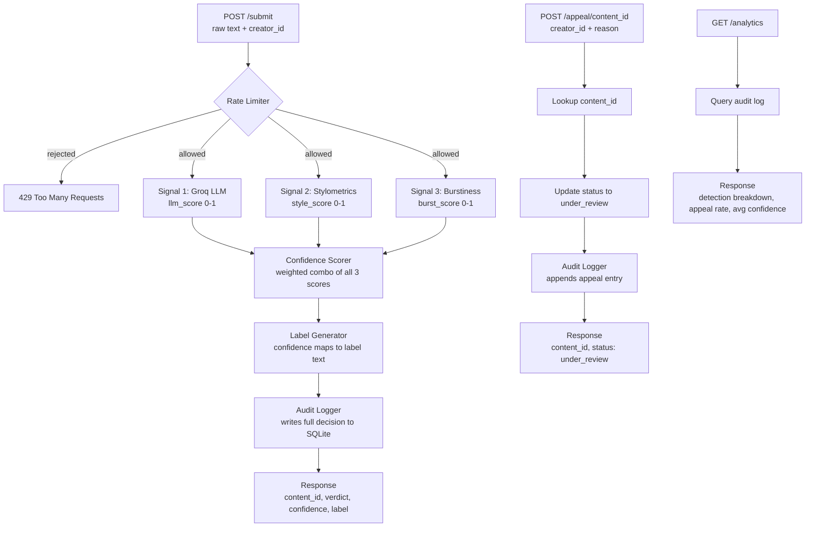

# Provenance Guard

A backend API system that classifies submitted creative writing as human-written or AI-generated, returns a confidence score and transparency label, and lets creators appeal classifications they think are wrong.

Built with Flask, Groq (llama-3.3-70b-versatile), and SQLite.

---

## Architecture



Text comes in through POST /submit, hits the rate limiter, runs through three independent signals, gets combined into a confidence score, maps to a transparency label, gets written to SQLite, and the response goes back with a content_id the creator can use to appeal. Appeals hit POST /appeal, look up the original decision, flip the status to under_review, and log the appeal reason alongside the original entry.

---

## API Endpoints

| Method | Endpoint | Description |
|---|---|---|
| POST | /submit | Submit text for classification |
| POST | /appeal | Contest a classification |
| GET | /log | View recent audit log entries |
| GET | /analytics | View detection stats and appeal rate |

---

## Detection Signals

### Signal 1: Groq LLM (weight: 50%)

This signal sends the text to llama-3.3-70b-versatile and asks it to score the writing from 0.0 (definitely human) to 1.0 (definitely AI) along with a one sentence explanation of why.

The reason this signal carries the most weight is that it picks up on things that are genuinely hard to measure statistically, like whether the word choices feel surprising or robotic, whether the structure feels too clean, or whether ideas flow the way a person actually thinks versus the way a model generates text. No pure statistical measure captures that kind of holistic feel.

The blind spot here is that clean formal human writing looks AI-like to this signal, and a messy or rambling AI output can look human-like. It is also possible in theory to craft text specifically designed to fool an LLM classifier.

### Signal 2: Stylometric Heuristics (weight: 30%)

This signal runs entirely in Python with no external calls. It looks at three measurable properties of the text: how much sentence lengths vary from each other, how diverse the vocabulary is (unique words divided by total words), and how much punctuation is used relative to the total characters. AI writing tends to be statistically uniform across all three of these, while human writing is generally messier and more variable.

The reason this signal is useful is that it is completely independent from the LLM. One signal is semantic and holistic, the other is structural and statistical. When they agree you have more confidence in the result. When they disagree, that disagreement is itself useful information about genuine uncertainty.

The main blind spot is that academic and technical human writing is deliberately uniform, so it will look AI-like to this signal. Short texts under around 80 words also do not give the statistics enough data to be meaningful.

### Signal 3: Burstiness (weight: 20%)

This signal measures whether the rhythm of the writing changes throughout the piece or stays weirdly steady from start to finish. It splits the text into chunks and measures how much the sentence length variance shifts between chunks. Low burstiness means a steady consistent rhythm which is more characteristic of AI writing.

The intuition here is that humans naturally write differently in different parts of a piece. The opening hits differently than the middle explanation which hits differently than the conclusion. AI tends to hold a suspiciously even pace the whole way through.

The blind spot is that short texts and structured pieces like listicles will show low burstiness even when a human wrote them, just because the format itself is uniform.

### How the Signals Get Combined

```
confidence = (llm_score * 0.5) + (style_score * 0.3) + (burst_score * 0.2)
```

If the three signals disagree with each other by more than 0.4, the score gets pulled 10% toward 0.5 to reflect that genuine uncertainty. The LLM gets the most weight because it captures things the statistical signals cannot, but the structural signals keep it honest when the text is short or formally written.

---

## Confidence Scoring

The thresholds work like this:
- 0.0 to 0.35 gets classified as likely human
- 0.36 to 0.79 gets classified as uncertain
- 0.80 to 1.0 gets classified as likely AI

The threshold for high confidence AI is set intentionally high. Calling a human creators work AI generated is a much worse mistake than missing an AI submission, so the system leans toward uncertain rather than flagging aggressively. A score has to be pretty convincingly AI-like across multiple signals before it gets that label.

### Example 1: Lower Confidence (Leaning Human)

Input: "ok so i finally tried that new ramen place downtown and honestly? underwhelming. the broth was fine but they put WAY too much sodium in it and i was thirsty for like three hours after. my friend got the spicy version and said it was better. probably wont go back unless someone drags me there"

```json
{
  "llm_score": 0.2,
  "style_score": 0.4427,
  "burst_score": 1.0,
  "confidence": 0.4395,
  "attribution": "uncertain"
}
```

The LLM correctly read this as human-like and the style score was moderate, but the burst score hit 1.0 because casual writing like this has no consistent rhythm at all, it just jumps around. The combined confidence came out to 0.4395 which lands in uncertain but clearly on the human end of that range. The signals all pointed in the same direction here, the score just was not low enough to clear the likely human threshold.

### Example 2: Higher Confidence (Leaning AI)

Input: "In conclusion it is important to note that leveraging synergistic paradigms across multiple verticals enables organizations to optimize their core competencies. Furthermore by implementing data-driven methodologies and fostering cross-functional collaboration stakeholders can ensure sustainable growth and maximize return on investment through strategic alignment of key performance indicators."

```json
{
  "llm_score": 0.9,
  "style_score": 0.5711,
  "burst_score": 0.5,
  "confidence": 0.7213,
  "attribution": "uncertain"
}
```

The LLM flagged this one strongly at 0.9 because the buzzword heavy corporate language is a pretty obvious pattern. Style and burst were moderate since it is only two sentences. Combined confidence came out to 0.7213, which is the highest score we saw across all our test inputs and sits right below the high confidence AI threshold. To cross 0.80 you really need the structural signals to agree with the LLM, which is hard to achieve with short texts even when the writing is obviously AI-like.

The gap between these two examples (0.4395 vs 0.7213) shows the scoring produces meaningful variation across different types of input rather than clustering everything in the middle.

---

## Transparency Labels

All three variants are written out below exactly as they appear in API responses.

### High Confidence Human (confidence 0.0 to 0.35)
```
This content appears to have been written by a human.
Our system analyzed the writing style and did not find strong indicators of AI generation.
Confidence: High
```

### Uncertain (confidence 0.36 to 0.79)
```
Our system was not able to confidently determine whether this content was written by a human or generated by AI.
This label may not be accurate. If you created this content yourself, you can submit an appeal below.
Confidence: Low
```

### High Confidence AI (confidence 0.80 to 1.0)
```
Our system flagged this content as likely AI-generated.
This label is based on automated analysis and may not be correct.
If you believe this is wrong, you can submit an appeal below.
Confidence: High
```

None of the labels say definitively "this IS AI content" because the system is never fully certain. All three point creators toward the appeals path if they disagree.

---

## Appeals Workflow

Any caller with a valid content_id can submit an appeal through POST /appeal with their content_id and a written explanation of why they think the classification is wrong. The system looks up the original classification, flips the status to under_review, and logs the appeal reason right alongside the original decision in the audit log. No automated re-classification happens, a human reviewer would look at both the original result and the creators reasoning together.

### Example Appeal Submission
```bash
python -c "import requests; r = requests.post('http://localhost:5000/appeal', json={'content_id': 'YOUR-ID-HERE', 'creator_reasoning': 'I wrote this myself. I am a non-native English speaker and my writing style may appear more formal than typical.', 'creator_id': 'test-user-1'}); print(r.json())"
```

### Example Appeal Response
```json
{
  "content_id": "e46819e1-6f0d-4b5f-8744-b88f7f311c24",
  "status": "under_review",
  "message": "Your appeal has been received and will be reviewed. Thank you for letting us know."
}
```

---

## Rate Limiting

The submission endpoint is limited to 10 requests per minute and 100 per day per IP address.

The reasoning behind these numbers is that a real creator submitting their own work might send a few pieces in a session but would rarely hit 10 in a single minute. That limit is generous enough for legitimate use but stops a script from flooding the system. 100 per day gives a power user plenty of room while making large scale abuse expensive. In a real deployment with user authentication these numbers would be tightened since you could rate limit per account instead of per IP, which is a lot more precise.

### Rate Limit Test Results

Sent 12 rapid requests back to back and got 200 for the first 10 and 429 for requests 11 and 12:

```
Request 1: 200
Request 2: 200
Request 3: 200
Request 4: 200
Request 5: 200
Request 6: 200
Request 7: 200
Request 8: 200
Request 9: 200
Request 10: 200
Request 11: 429
Request 12: 429
```

---

## Audit Log

Every classification and appeal gets written to SQLite as a structured entry. Here is a sample from GET /log showing both a classification entry and its associated appeal:

```json
{
  "entries": [
    {
      "appeal_reason": "I wrote this myself from personal experience. I am a non-native English speaker and my writing style may appear more formal than typical.",
      "attribution": null,
      "burst_score": null,
      "confidence": null,
      "content_id": "e46819e1-6f0d-4b5f-8744-b88f7f311c24",
      "creator_id": "test-user-1",
      "entry_type": "appeal",
      "id": 2,
      "label": null,
      "llm_score": null,
      "status": "under_review",
      "style_score": null,
      "timestamp": "2026-07-01T04:02:42.727223+00:00"
    },
    {
      "appeal_reason": null,
      "attribution": "uncertain",
      "burst_score": 0.5,
      "confidence": 0.3931,
      "content_id": "e46819e1-6f0d-4b5f-8744-b88f7f311c24",
      "creator_id": "test-user-1",
      "entry_type": "classification",
      "id": 1,
      "label": "Our system was not able to confidently determine whether this content was written by a human or generated by AI. This label may not be accurate. If you created this content yourself, you can submit an appeal below. Confidence: Low",
      "llm_score": 0.2,
      "status": "under_review",
      "style_score": 0.6039,
      "timestamp": "2026-07-01T04:01:42.617927+00:00"
    }
  ]
}
```

---

## Analytics Dashboard (Stretch Feature)

GET /analytics queries the audit log and returns a breakdown of how submissions got classified, what percentage of them were appealed, and the average confidence score across all submissions.

### Example Response
```json
{
  "appeal_rate_percent": 14.29,
  "average_confidence": 0.3839,
  "detection_breakdown": {
    "likely_ai": 0,
    "likely_human": 10,
    "uncertain": 4
  },
  "total_appeals": 2,
  "total_submissions": 14
}
```

---

## Known Limitations

**Short or structured creative writing scores unreliably.** A haiku, a short poem, or a three sentence flash fiction piece does not give the stylometric and burstiness signals enough data to produce meaningful numbers. Both signals need a certain volume of text before the statistics stabilize, and when there is not enough text they default to 0.5 which just pulls the confidence score toward the middle. The problem is the system has no way to flag that its own confidence estimate is less trustworthy on short texts, so a user just sees an uncertain label with no explanation of why.

**Academic and technical human writing looks AI-like to the structural signals.** Someone writing documentation, a formal essay, or anything in a strict academic style will naturally produce low sentence variance, consistent vocabulary, and light punctuation, which is exactly what signals 2 and 3 look for as AI indicators. The high confidence AI threshold being set at 0.80 helps here since most formal human writing lands in uncertain rather than getting the AI label, but it still means a lot of legitimate formal writing does not get the likely human label it probably deserves.

---

## Spec Reflection

One way the spec genuinely helped was forcing the transparency label text to be written out in planning.md before any code was written. Having to commit to the exact wording and the exact threshold numbers before seeing any real scores made the label logic straightforward to implement later because all the actual design decisions were already made. There was nothing to figure out mid-implementation.

One way the implementation diverged from the spec was around short text handling. The plan called for explicitly down-weighting signals 2 and 3 for texts under 80 words and flagging in the response that confidence might be lower than shown. That did not end up getting built. In practice both signals return 0.5 as a default when there is not enough text, which naturally pulls the score toward uncertain, so the behavior is roughly correct even without the explicit handling. A real deployment would still want the explicit flag so users understand why they got an uncertain result instead of just seeing a low confidence score with no context.

---

## AI Usage

**Instance 1: Flask app skeleton and Groq signal function.** The AI was given the detection signals section from planning.md and the architecture diagram and asked to generate the Flask app skeleton with the POST /submit route and the LLM signal function. The structure it produced was mostly right but the prompt it wrote for the LLM was too open-ended and was not asking for a structured response. The prompt got rewritten to explicitly ask for a JSON object with a score field and a reason field, and error handling was added for cases where the LLM response could not be parsed.

**Instance 2: Stylometrics and burstiness functions.** The AI was given the Signal 2 and Signal 3 descriptions from planning.md and asked to implement both as standalone Python functions returning 0 to 1 scores. The stylometrics function was mostly correct but the punctuation scoring logic was backwards, higher punctuation density was being treated as more AI-like when it should be treated as more human-like since humans use punctuation more freely. That logic got flipped to match what the spec actually described.

---

## Setup

```bash
git clone https://github.com/yourusername/ai201-project4-provenance-guard
cd ai201-project4-provenance-guard
python -m venv .venv
source .venv/bin/activate
pip install -r requirements.txt
```

Create a .env file in the repo root:
```
GROQ_API_KEY=your_key_here
```

Then run:
```bash
python app.py
```