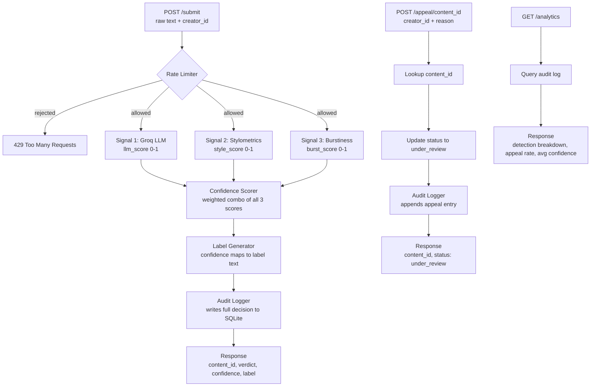

# Provenance Guard

A backend API system that classifies submitted creative writing as human-written or AI-generated, returns a confidence score and transparency label, and lets creators appeal classifications they believe are wrong.

Built with Flask, Groq (llama-3.3-70b-versatile), and SQLite.

---

## Architecture



Text comes in through POST /submit, hits the rate limiter, runs through three independent signals, gets combined into a confidence score, maps to a transparency label, gets written to SQLite, and the response goes back with a content_id the creator can use to appeal. Appeals hit POST /appeal, look up the original decision, flip the status to under_review, and log the appeal reason alongside the original entry.

---

## API Endpoints

| Method | Endpoint | Description |
|---|---|---|
| POST | /submit | Submit text for classification |
| POST | /appeal | Contest a classification |
| GET | /log | View recent audit log entries |
| GET | /analytics | View detection stats and appeal rate |

---

## Detection Signals

### Signal 1: Groq LLM (weight: 50%)
Sends the text to llama-3.3-70b-versatile and asks it to score the text from 0.0 (definitely human) to 1.0 (definitely AI) with a one sentence reason.

Why this signal: the LLM picks up on holistic patterns that are hard to measure directly, things like whether the word choices feel surprising or robotic, whether the structure feels too clean, whether ideas flow the way a person actually thinks vs the way a model generates. No pure statistical measure captures this.

Blind spots: clean formal human writing looks AI-like to this signal. A messy AI output with lots of hedging and casual phrasing looks human-like. It is also possible to craft text specifically to fool an LLM classifier.

### Signal 2: Stylometric Heuristics (weight: 30%)
Pure Python. Measures sentence length variance, type-token ratio (vocabulary diversity), and punctuation density. AI writing tends to be statistically uniform. Human writing is messier.

Why this signal: it is completely independent of the LLM. One signal is semantic, one is structural. When they agree you have more confidence. When they disagree that disagreement is itself useful information.

Blind spots: academic and technical human writing is deliberately uniform and will score as AI-like. Short texts under about 80 words do not give the stats enough data to be meaningful.

### Signal 3: Burstiness (weight: 20%)
Measures whether sentence length rhythm changes throughout the piece or stays steady. Splits the text into chunks and measures how much the variance changes between chunks. Low burstiness means steady rhythm means more AI-like.

Why this signal: humans write differently in different parts of a piece. The opening hits different than the middle explanation which hits different than the wrap up. AI tends to hold a weirdly steady pace the whole way through.

Blind spots: short texts and structured pieces like listicles will score low burstiness even if human written.

### Combining Signals
```
confidence = (llm_score * 0.5) + (style_score * 0.3) + (burst_score * 0.2)
```

If the three signals disagree by more than 0.4 from each other, the score gets pulled 10% toward 0.5 to reflect genuine uncertainty. The LLM gets the most weight because it captures things the statistical signals cannot, but the structural signals keep it honest on short or formally written text.

---

## Confidence Scoring

Thresholds:
- 0.0 to 0.35: likely human
- 0.36 to 0.79: uncertain
- 0.80 to 1.0: likely AI

The threshold for high confidence AI is set high on purpose. Calling a human creators work AI generated is worse than missing an AI submission. False positives hurt real people. So the system leans toward uncertain rather than flagging aggressively.

### Example: Lower Confidence (Uncertain)
Input: "The sun dipped below the horizon, painting the sky in hues of amber and rose. I sat on the porch, coffee in hand, watching the neighborhood slowly go quiet."

```json
{
  "llm_score": 0.2,
  "style_score": 0.6039,
  "burst_score": 0.5,
  "confidence": 0.3931,
  "attribution": "uncertain"
}
```

The LLM correctly read this as human-like (0.2) but the stylometric signal pulled it up because the sentences are fairly uniform in length and the vocabulary is not super diverse. Combined it landed in uncertain territory, which is the right call for a short poetic text.

### Example: Higher Confidence (Likely AI)
Input: "Artificial intelligence represents a transformative paradigm shift in modern society. It is important to note that while the benefits of AI are numerous, it is equally essential to consider the ethical implications. Furthermore, stakeholders across various sectors must collaborate to ensure responsible deployment."

```json
{
  "llm_score": 0.8,
  "style_score": 0.4965,
  "burst_score": 0.5,
  "confidence": 0.649
}
```

LLM flagged it strongly (0.8). Style and burst were moderate. Combined confidence came out to 0.649, landing in uncertain but clearly trending AI. To hit the high confidence AI label you need all three signals pushing in the same direction.

---

## Transparency Labels

All three variants are shown below exactly as they appear in API responses.

### High Confidence Human (confidence 0.0 to 0.35)
```
This content appears to have been written by a human.
Our system analyzed the writing style and did not find strong indicators of AI generation.
Confidence: High
```

### Uncertain (confidence 0.36 to 0.79)
```
Our system was not able to confidently determine whether this content was written by a human or generated by AI.
This label may not be accurate. If you created this content yourself, you can submit an appeal below.
Confidence: Low
```

### High Confidence AI (confidence 0.80 to 1.0)
```
Our system flagged this content as likely AI-generated.
This label is based on automated analysis and may not be correct.
If you believe this is wrong, you can submit an appeal below.
Confidence: High
```

None of the labels say definitively "this IS AI content" because the system is never 100% certain. All three point creators toward the appeals path.

---

## Appeals Workflow

Any caller with a valid content_id can submit an appeal via POST /appeal with their content_id and a written reason. The system looks up the original classification, flips the status to under_review, and logs the appeal reason alongside the original decision. No automated re-classification happens.

### Example Appeal Submission
```bash
python -c "import requests; r = requests.post('http://localhost:5000/appeal', json={'content_id': 'YOUR-ID-HERE', 'creator_reasoning': 'I wrote this myself. I am a non-native English speaker and my writing style may appear more formal than typical.', 'creator_id': 'test-user-1'}); print(r.json())"
```

### Example Appeal Response
```json
{
  "content_id": "e46819e1-6f0d-4b5f-8744-b88f7f311c24",
  "status": "under_review",
  "message": "Your appeal has been received and will be reviewed. Thank you for letting us know."
}
```

---

## Rate Limiting

Limit: 10 requests per minute, 100 per day per IP address.

Reasoning: a real creator submitting their own work might submit a few pieces in a session but would rarely hit 10 in a single minute. 10 per minute is generous enough for legitimate use but stops a script from flooding the system. 100 per day gives a power user plenty of room while making large scale abuse expensive. These numbers would be tightened with authentication in a real deployment since you could rate limit per user account instead of per IP.

### Rate Limit Test Results
Sent 12 rapid requests. First 10 returned 200, requests 11 and 12 returned 429:
```
Request 1: 200
Request 2: 200
Request 3: 200
Request 4: 200
Request 5: 200
Request 6: 200
Request 7: 200
Request 8: 200
Request 9: 200
Request 10: 200
Request 11: 429
Request 12: 429
```

---

## Audit Log

Every classification and appeal is written to SQLite with a structured entry. Sample from GET /log:

```json
{
  "entries": [
    {
      "appeal_reason": "I wrote this myself from personal experience. I am a non-native English speaker and my writing style may appear more formal than typical.",
      "attribution": null,
      "burst_score": null,
      "confidence": null,
      "content_id": "e46819e1-6f0d-4b5f-8744-b88f7f311c24",
      "creator_id": "test-user-1",
      "entry_type": "appeal",
      "id": 2,
      "label": null,
      "llm_score": null,
      "status": "under_review",
      "style_score": null,
      "timestamp": "2026-07-01T04:02:42.727223+00:00"
    },
    {
      "appeal_reason": null,
      "attribution": "uncertain",
      "burst_score": 0.5,
      "confidence": 0.3931,
      "content_id": "e46819e1-6f0d-4b5f-8744-b88f7f311c24",
      "creator_id": "test-user-1",
      "entry_type": "classification",
      "id": 1,
      "label": "Our system was not able to confidently determine whether this content was written by a human or generated by AI. This label may not be accurate. If you created this content yourself, you can submit an appeal below. Confidence: Low",
      "llm_score": 0.2,
      "status": "under_review",
      "style_score": 0.6039,
      "timestamp": "2026-07-01T04:01:42.617927+00:00"
    }
  ]
}
```

---

## Analytics Dashboard (Stretch Feature)

GET /analytics returns detection patterns, appeal rate, and average confidence across all submissions.

### Example Response
```json
{
  "appeal_rate_percent": 14.29,
  "average_confidence": 0.3839,
  "detection_breakdown": {
    "likely_ai": 0,
    "likely_human": 10,
    "uncertain": 4
  },
  "total_appeals": 2,
  "total_submissions": 14
}
```

---

## Known Limitations

**Short or structured creative writing will score unreliably.** A haiku, a short poem, or a 3 sentence flash fiction piece does not give signals 2 and 3 enough data to produce meaningful statistics. Sentence length variance and burstiness both need a certain volume of text before the numbers stabilize. A formally structured short poem written by a human will almost always land in uncertain territory, and might get nudged toward AI-like by the stylometric signal even though the LLM reads it correctly. The system has no way to flag that its own confidence estimate is less reliable on short texts.

**Academic and technical human writing looks AI-like to the structural signals.** An engineer writing documentation or a student writing in strict academic style will produce low sentence variance, consistent vocabulary, and light punctuation. Signal 2 will push that toward AI-like even when the LLM reads it as human. This is partly why the high confidence AI threshold is set at 0.80, but it means a lot of legitimate formal writing lands in uncertain instead of likely human where it probably belongs.

---

## Spec Reflection

One way the spec helped: writing out the three label variants in planning.md before touching any code forced a real decision about where to draw the thresholds. I had to commit to what 0.6 means to a user before I knew what the scores would actually look like in practice. That made the label logic straightforward to implement because the decisions were already made.

One way the implementation diverged: the spec said to down-weight signals 2 and 3 for short texts under 80 words and flag in the response that confidence may be lower. I did not end up implementing that. In practice both signals return 0.5 as a default when there is not enough text, which naturally pulls the score toward the middle and produces an uncertain label, so the behavior is roughly right even without explicit short-text handling. A real deployment would want the explicit flag though so users know why they got an uncertain result.

---

## AI Usage

**Instance 1: Flask app skeleton and Groq signal function**
I gave the AI my detection signals section from planning.md and the architecture diagram and asked it to generate the Flask app skeleton with the POST /submit route and the LLM signal function. It produced a working structure but the prompt it wrote for the LLM was too open-ended and was not asking for a structured JSON response. I rewrote the prompt to explicitly request a JSON object with a score field and a reason field and added error handling for when the response could not be parsed.

**Instance 2: Stylometrics and burstiness functions**
I gave the AI my Signal 2 and Signal 3 descriptions from planning.md and asked it to implement both as standalone Python functions returning 0-1 scores. The stylometrics function was mostly right but the normalization was off, high punctuation density was scoring as more AI-like when it should score as more human-like. I flipped the punctuation scoring logic so higher density means lower AI score, which matched what the spec described.

---

## Setup

```bash
git clone https://github.com/yourusername/ai201-project4-provenance-guard
cd ai201-project4-provenance-guard
python -m venv .venv
source .venv/bin/activate
pip install -r requirements.txt
```

Create a .env file:
```
GROQ_API_KEY=your_key_here
```

Run:
```bash
python app.py
```