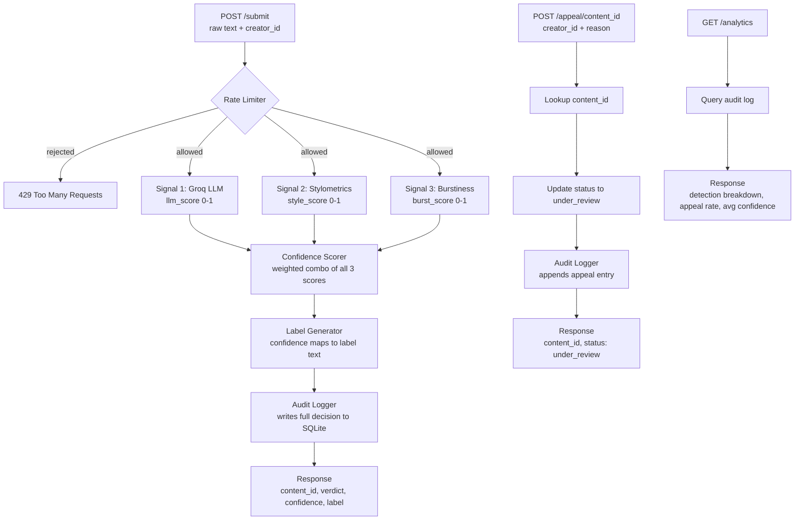

# Provenance Guard — planning.md

## Detection Signals

### Signal 1: Groq LLM (llm_score)
Sends the text to llama-3.3-70b-versatile with a prompt asking it to judge whether the writing feels human or AI generated. The prompt asks for a score from 0.0 to 1.0 where 0 is definitely human and 1 is definitely AI, plus a one sentence reason.

Output: a float between 0.0 and 1.0

Why it works: AI text tends to be clean, confident, and weirdly well structured. Human writing wanders, makes odd choices, hedges in unexpected spots. The LLM picks up on those patterns holistically.

Blind spots: a clean formal human writer will look AI-like. A messy AI output looks human-like. Also someone could craft text specifically to fool an LLM classifier.

Weight in final score: 50%

### Signal 2: Stylometric Heuristics (style_score)
Pure Python. Measures three things:
- Sentence length variance: how much sentence lengths differ from each other. AI text is more uniform.
- Type-token ratio (TTR): unique words divided by total words. AI reuses vocabulary more predictably.
- Punctuation density: ratio of punctuation marks to total characters. Humans use dashes, ellipses, comma splices more freely.

Each of the three sub-measures gets normalized to 0-1 and averaged into one style_score. Higher score = more AI-like (more uniform, less vocab diversity, less punctuation).

Output: a float between 0.0 and 1.0

Blind spots: academic or technical human writing is deliberately uniform and will score as AI-like. Short texts under ~100 words dont give the stats enough to be reliable.

Weight in final score: 30%

### Signal 3: Burstiness Score (burst_score) — Ensemble Stretch
Measures whether sentence length rhythm changes throughout the piece or stays weirdly steady. Splits the text into chunks and measures how much the variance changes chunk to chunk. Low burstiness = steady rhythm = more AI-like.

Output: a float between 0.0 and 1.0 (higher = more AI-like, meaning low burstiness)

Blind spots: short texts or structured pieces like listicles will have low burstiness even if human written. Poems with intentional repetition will also score weird here.

Weight in final score: 20%

### Combining Into One Confidence Score
```
confidence = (llm_score * 0.5) + (style_score * 0.3) + (burst_score * 0.2)
```

If the three signals disagree by more than 0.4 from each other, the confidence score gets pulled 10% toward 0.5 to reflect genuine uncertainty.

---

## Uncertainty Representation

Thresholds:
- 0.0 to 0.35: likely human
- 0.36 to 0.64: uncertain
- 0.65 to 1.0: likely AI

A score of 0.6 lands in uncertain territory. It does NOT get labeled as AI. It gets the uncertain label which is softer in language and specifically tells the reader the system isnt confident.

The threshold for "high confidence AI" is intentionally high (0.80+) because calling a humans work AI generated is worse than missing an AI submission. False positives hurt real people.

Score to label mapping:
- 0.0 to 0.35: high confidence human label
- 0.36 to 0.64: uncertain label
- 0.65 to 0.79: uncertain leaning AI label (still uses uncertain label variant)
- 0.80 to 1.0: high confidence AI label

So really there are still three label variants but the uncertain bucket covers 0.36 to 0.79 which is a wide range on purpose.

---

## Transparency Label Design

### High Confidence Human (confidence 0.0 to 0.35)
```
This content appears to have been written by a human.
Our system analyzed the writing style and did not find strong indicators of AI generation.
Confidence: High
```

### Uncertain (confidence 0.36 to 0.79)
```
Our system was not able to confidently determine whether this content was written by a human or generated by AI.
This label may not be accurate. If you created this content yourself, you can submit an appeal below.
Confidence: Low
```

### High Confidence AI (confidence 0.80 to 1.0)
```
Our system flagged this content as likely AI-generated.
This label is based on automated analysis and may not be correct.
If you believe this is wrong, you can submit an appeal below.
Confidence: High
```

All three labels include plain language. None of them say definitively "this IS AI content" because the system is never 100% certain.

---

## Appeals Workflow

Who can appeal: anyone with a valid content_id. In a real platform this would be locked to the creator who submitted it but for this build any caller with the content_id can appeal.

What they provide:
- content_id (in the URL)
- creator_id (in the request body)
- reason (their written explanation, required)

What the system does:
1. Looks up the content_id in the audit log
2. Flips the status field from "reviewed" to "under_review"
3. Writes a new audit log entry with the appeal reason, creator_id, and timestamp alongside the original decision
4. Returns confirmation with the new status

What a human reviewer would see in the appeal queue (via GET /log):
- Original decision: content_id, verdict, confidence, all three signal scores, label shown, timestamp
- Appeal entry: same content_id, creator reasoning, who appealed, when they appealed
- Status: under_review

No automated re-classification happens. A human looks at it and decides.

---

## Anticipated Edge Cases

### Edge Case 1: Short poems or haiku
Stylometrics and burstiness both need enough text to produce meaningful stats. A 17 syllable haiku or a 4 line poem gives almost nothing to work with. The scores from signals 2 and 3 will be unreliable, but the system doesnt know that -- it will still combine them and produce a confidence score that looks real but isnt. A formally structured poem will probably get flagged as AI-like even if a human wrote it.

Mitigation: if text is under 80 words, the system should down-weight signals 2 and 3 and rely more heavily on the LLM signal. Flag in the response that confidence may be lower than shown for short texts.

### Edge Case 2: Technical or academic writing by humans
A human writing a formal essay or documentation will produce text with low sentence variance, high structure, and consistent vocabulary -- which looks exactly like AI output to signals 2 and 3. An engineer writing API docs or a student writing in a strict academic style will likely get flagged as uncertain or AI-like even with perfectly human written content.

Mitigation: this is partly why the "high confidence AI" threshold is set at 0.80. Academic writing might push someone to 0.65-0.75 which lands in the uncertain label, not the AI label. The appeals path handles the rest.

### Edge Case 3: AI text that was heavily edited by a human
Someone generates text with AI then spends an hour editing it, adding personal anecdotes, fixing the rhythm, changing vocab. At that point is it AI content? The system will probably score it somewhere in the uncertain range because the editing introduced human-like variance. This is genuinely ambiguous and the system should not pretend otherwise.

---

## Architecture



Submission flow: text comes in, hits the rate limiter, runs through all three signals, gets combined into a confidence score, maps to a label, gets logged, and the response goes back to the caller with everything they need including the content_id for appeals.

Appeal flow: creator sends their content_id and reason, system looks up the original decision, flips the status to under_review, logs the appeal next to the original entry, and confirms back to the caller.

---

## AI Tool Plan

### M3: Submission Endpoint + First Signal
Spec sections to provide: Detection Signals (Signal 1 only), Architecture diagram
Ask for: Flask app skeleton with POST /submit route + the Groq LLM signal function that returns a 0-1 score
Verify by: calling the endpoint with 3 test inputs (one obviously AI, one obviously human, one ambiguous) and checking that the llm_score varies meaningfully across them before wiring anything else in

### M4: Second + Third Signal + Confidence Scoring
Spec sections to provide: Detection Signals (Signals 2 and 3), Uncertainty Representation section, Architecture diagram
Ask for: stylometrics function, burstiness function, and the confidence scorer that combines all three with the documented weights
Verify by: checking that a clearly AI input scores above 0.65 and a clearly human input scores below 0.35 -- if both land in the middle something is wrong with the weighting or normalization

### M5: Production Layer
Spec sections to provide: Transparency Label Design, Appeals Workflow, Architecture diagram
Ask for: label generator function, POST /appeal endpoint, GET /log endpoint, rate limiting setup, SQLite audit logger
Verify by: hitting all three label thresholds with test inputs, submitting an appeal and checking the status changes, and confirming GET /log returns at least 3 entries with all the right fields

### Stretch M: Analytics Dashboard
Spec sections to provide: Architecture diagram, Appeals Workflow, Uncertainty Representation (for the threshold definitions)
Ask for: GET /analytics endpoint that queries SQLite and returns detection breakdown by verdict, appeal rate as a percentage, and average confidence score across all submissions
Verify by: submitting a mix of test inputs and appeals first, then checking that the analytics numbers match what you know you submitted